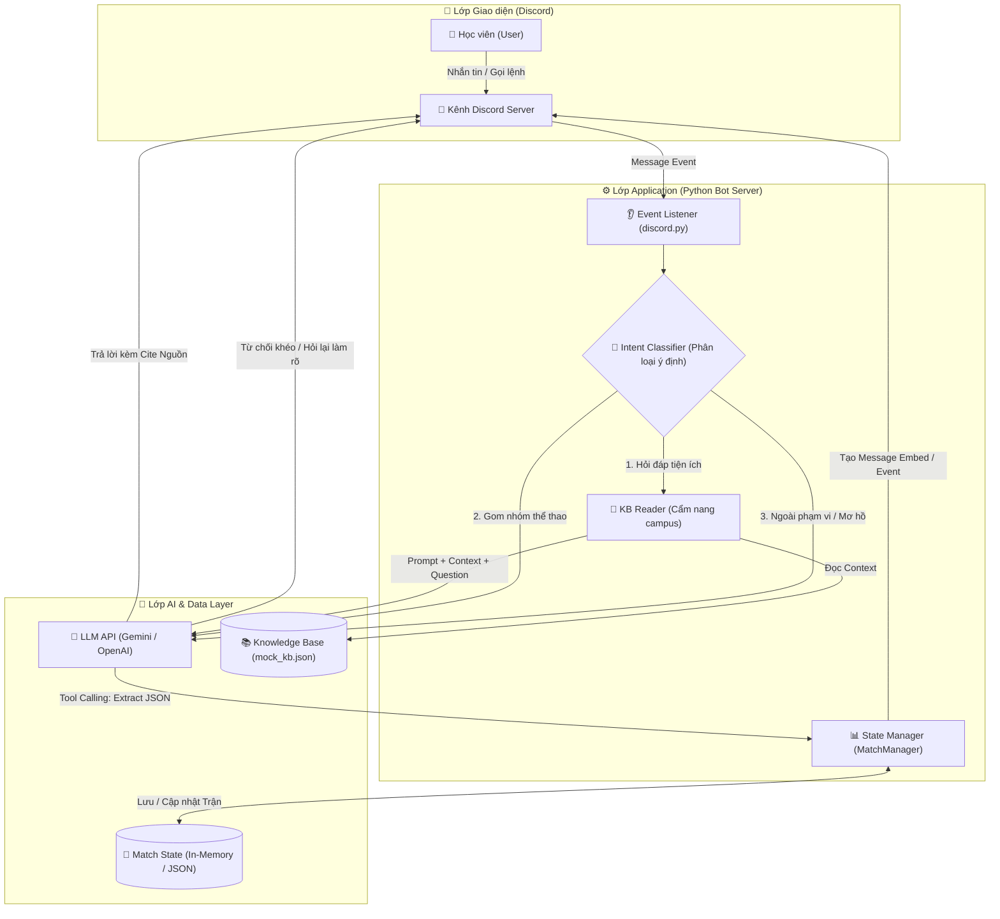
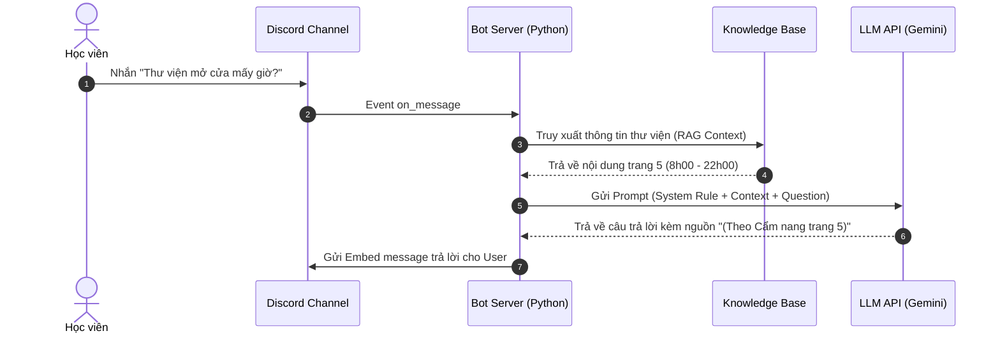
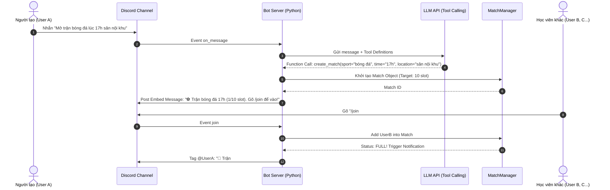

# Đặc tả Kiến trúc & Luồng hoạt động (Architecture & Workflows)

Dự án: **VinUni Discord AI Assistant**

Tài liệu này mô tả kiến trúc kỹ thuật tổng thể, các luồng tương tác chính (User - Bot - AI) và đề xuất phân chia công việc (Task breakdown) để team dễ dàng hình dung quá trình phát triển (build) sản phẩm.

---

## 1. Kiến trúc tổng thể (System Architecture)

Hệ thống được chia làm 3 lớp (Layers) chính:

1. **Lớp Giao diện (Interface Layer - Discord):**
   - Nơi người dùng tương tác trực tiếp (Nhắn tin, gọi lệnh `/`, bấm nút reaction).
   - Discord App/Server sẽ đóng vai trò như UI/UX chính của ứng dụng.

2. **Lớp Logic Ứng dụng (Application Layer - Python Bot Server):**
   - Dùng thư viện `discord.py` để lắng nghe sự kiện (tin nhắn, lệnh) từ Discord.
   - **Router:** Nhận diện tin nhắn thuộc về luồng "Hỏi đáp tiện ích" hay luồng "Gom nhóm thể thao".
   - **State Manager:** Quản lý trạng thái các "Trận đấu" đang mở (Lưu trữ tạm trong RAM bằng Dictionary hoặc file JSON/SQLite nhỏ). Quản lý số lượng người join, thời gian, trạng thái đủ người.

3. **Lớp Trí tuệ Nhân tạo & Dữ liệu (AI & Data Layer):**
   - **LLM API (Gemini/OpenAI):** 
     - *Xử lý ngôn ngữ tự nhiên:* Sinh câu trả lời thân thiện.
     - *Tool Calling/Function Calling:* Bóc tách thông tin từ tin nhắn người dùng (Giờ, Sân, Môn thể thao) thành JSON có cấu trúc.
   - **Knowledge Base (Mock):** File `.txt` hoặc `.json` chứa dữ liệu nội khu (giờ mở cửa căn tin, thư viện...) để LLM đọc và trả lời (cơ chế RAG đơn giản).

### Sơ đồ Kiến trúc Tổng thể (Overall Flowchart)

---

## 2. Các luồng hoạt động chính (Core Workflows)

### Luồng 1: Hỏi đáp tiện ích (Q&A Workflow)

1. **User** nhắn câu hỏi: *"Thư viện mấy giờ đóng cửa?"*
2. **Bot Server** nhận tin nhắn -> Nhận diện đây là câu hỏi thông tin.
3. **Bot Server** đọc file `knowledge_base.txt` lấy context.
4. **Bot Server** gửi (Context + Tin nhắn User) cho **LLM**.
5. **LLM** trả về câu trả lời có trích dẫn nguồn.
6. **Bot Server** gửi câu trả lời lên kênh Discord.

#### Sơ đồ Luồng Hỏi Đáp (Q&A Sequence Diagram)

---

### Luồng 2: Tạo trận & Tham gia trận (Matchmaking Workflow)

1. **User A** gõ lệnh (ví dụ: `/mo-tran bong-da 17h san-bong`) hoặc tag bot nói *"Mở trận bóng đá lúc 17h chiều nay"*.
2. **Bot Server** gửi tin nhắn cho **LLM** dùng Tool Calling. **LLM** trích xuất ra JSON: `{"action": "create", "sport": "bong-da", "time": "17h", "location": "san-bong"}`.
3. **Bot Server (State Manager)** tạo một Object `Match`, lưu vào bộ nhớ, và sinh ra một tin nhắn Event/Poll (đẹp mắt bằng Embed) trên Discord kèm hướng dẫn: *"Trận bóng đá 17h đã mở. Gõ `/join` hoặc thả tim để tham gia"*.
4. **User B, C, D** thấy thông báo, gõ `/join` hoặc react emoji.
5. **Bot Server** cập nhật số lượng người vào bộ nhớ. Kiểm tra xem đã đủ điều kiện chưa (vd: đủ 10 người).
6. **Trigger Thông báo:** Nếu đủ 10 người, Bot chủ động gửi tin nhắn tag **User A** (người tạo): *"Đã đủ 10 người, bạn có chốt kèo không?"*

#### Sơ đồ Luồng Gom Nhóm (Matchmaking Sequence Diagram)

---

## 3. Phân chia công việc (Task Breakdown)

Dựa trên kiến trúc trên, nhóm có thể chia công việc thành các luồng chạy song song:

### Phase 1: Setup Foundation (Nền tảng)
- **Task 1.1:** (Tuyền) Tạo Discord Bot trên Developer Portal, lấy Token, setup project Python với `discord.py`, làm bot online và phản hồi được câu "Ping - Pong".
- **Task 1.2:** (Tiến Dũng) Tạo file Knowledge Base giả lập (TXT/JSON) chứa khoảng 10-15 câu hỏi/đáp thông dụng về VinUni. Viết file Prompt mẫu (System Prompt).

### Phase 2: Core Features (Tính năng lõi)
- **Task 2.1 (Hỏi đáp):** Kết nối API Gemini/OpenAI vào Bot. Truyền file Knowledge Base vào prompt để Bot trả lời được đúng thông tin mà không bịa đặt.
- **Task 2.2 (Gom nhóm - Khó):** Xây dựng class quản lý trạng thái (`MatchManager`). Viết logic bắt lệnh tạo trận (tạo message Embed đẹp trên Discord), nhận lệnh join (cập nhật data), và báo cáo đủ slot.
- **Task 2.3 (Tool Calling):** Thiết lập Function Calling cho LLM để nó tự bóc tách giờ giấc, môn thể thao từ tin nhắn chữ của user thành JSON gọi API của code Python.

### Phase 3: Hoàn thiện & Xử lý lỗi (CP4 & CP5)
- **Task 3.1:** Chạy test 20 câu (Golden set) để đánh giá độ chính xác của luồng hỏi đáp.
- **Task 3.2:** Bắt các case lỗi: Thiếu giờ, User rủ ngoài phạm vi, Người dùng tạo sai giờ đòi huỷ (Nguyên tắc G8/G17).
