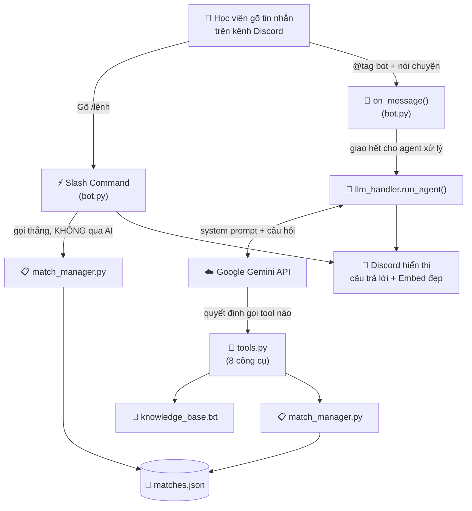
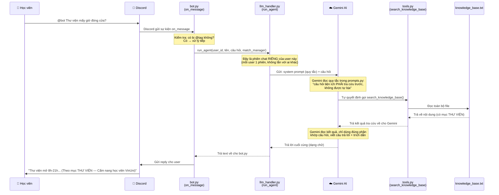
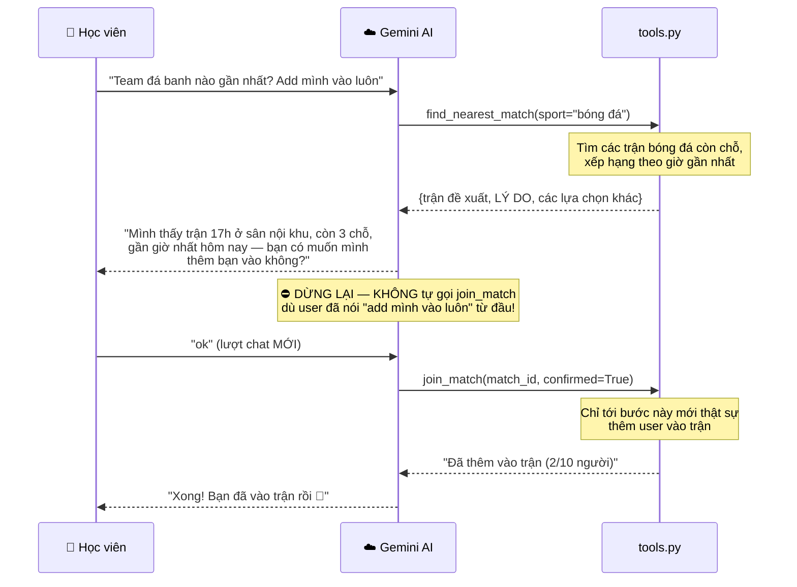

# 🤖 VinUni Discord AI Assistant — Code hoạt động thế nào

Tài liệu này giải thích cách toàn bộ code trong `src/` hoạt động cùng nhau —
từ lúc một học viên nhắn tin trên Discord, cho đến lúc bot trả lời. Viết cho
người **không rành code** vẫn đọc hiểu được, nên chỗ nào có thuật ngữ kỹ
thuật sẽ giải thích ngay bên cạnh.

> Nếu bạn chỉ cần chạy thử bot, nhảy thẳng xuống mục **[🚀 Hướng dẫn chạy
> thử](#-hướng-dẫn-chạy-thử-quick-start)** ở cuối file.

---

## 🧠 Bot này làm được gì?

2 việc, không hơn:

1. **Tra cứu tiện ích campus** — hỏi giờ mở cửa căn tin, thư viện, đường đi
   giữa các toà, sân thể thao... bot trả lời dựa trên 1 file dữ liệu cố định
   (không tự bịa).
2. **Gom nhóm chơi thể thao** — xem/tạo/tham gia/sửa/huỷ trận, và đặc biệt:
   bot có thể **tự đi tìm** trận phù hợp nhất và **đề xuất** cho bạn, nhưng
   sẽ luôn hỏi lại trước khi thật sự thêm bạn vào trận.

Bot có **2 cách được gọi**, chạy song song, không đụng nhau:

| Cách gọi | Có qua AI không? | Khi nào dùng |
|---|---|---|
| Gõ `/lệnh` (Slash Command) | ❌ Không — code Python xử lý thẳng | User biết chính xác muốn làm gì (vd `/xem-tran`) |
| `@tag bot` + nói chuyện tự nhiên | ✅ Có — qua Gemini AI | User hỏi/nhờ bằng câu bình thường, không cần nhớ cú pháp |

---

## 📁 Cấu trúc thư mục

```
src/
├── bot.py              ← File CHÍNH. Chạy file này để bật bot.
├── llm_handler.py       ← Cầu nối giữa bot và Gemini AI (agent thật + tool calling).
├── tools.py             ← 8 "công cụ" mà AI được phép gọi (tra cứu, tạo/sửa/huỷ trận...).
├── prompts.py            ← "Bộ não" — chỉ dẫn AI phải cư xử thế nào trong từng tình huống.
├── match_manager.py     ← Sổ quản lý các trận thể thao (lưu/đọc/sửa dữ liệu).
└── router.py             ← Vài hàm tiện ích nhỏ (đoán giờ trong câu chữ...). Xem lưu ý ở dưới.

data/
├── knowledge_base.txt   ← "Sách giáo khoa" của bot — AI CHỈ được trả lời dựa trên đây.
└── matches.json          ← Dữ liệu các trận thể thao (tự sinh, tự cập nhật khi bot chạy).

eval/
├── golden_set.json       ← 25 câu hỏi/tình huống mẫu để chấm điểm bot trả lời đúng/sai.
└── run_eval.py           ← Script chạy cả 25 câu qua AI thật, chấm điểm, lưu kết quả.
    └── runs/              ← Kết quả từng lần chạy (v1, v2, v3...) để so sánh qua các lần sửa.

logs/
└── agent_calls.jsonl     ← Nhật ký MỌI lượt AI trả lời thật (để biết AI thật có chạy, không hardcode).

.env                      ← Chứa mật khẩu (Token, API Key). KHÔNG BAO GIỜ commit lên Git.
```

---

## 🗺️ Sơ đồ tổng quan hệ thống



**Đọc sơ đồ này thế nào:** Có 2 đường đi song song từ lúc user nhắn tin.
Đường `/lệnh` (bên trái) đi thẳng, nhanh, không cần AI — phù hợp khi user
biết chính xác muốn làm gì. Đường `@tag bot` (bên phải) đi qua AI thật
(Gemini) — AI tự đọc system prompt (bộ quy tắc trong `prompts.py`), tự
quyết định có cần gọi công cụ nào trong `tools.py` hay không, rồi mới trả
lời. Cả 2 đường cuối cùng đều đọc/ghi vào cùng 1 chỗ lưu dữ liệu
(`matches.json`), nên dữ liệu luôn nhất quán dù user dùng cách nào.

---

## 🔄 Luồng chi tiết: từ lúc nhắn tin đến lúc bot trả lời

Đây là phần quan trọng nhất — theo dõi từng bước 1 tin nhắn thật đi qua hệ
thống, dùng ví dụ: **"@bot Thư viện mấy giờ đóng cửa?"**



**7 bước, tóm tắt bằng lời:**
1. User gõ tin nhắn, tag bot.
2. `bot.py` (hàm `on_message`) nhận được, kiểm tra có bị tag không — có thì xử lý tiếp, không thì bỏ qua (bot không đọc trộm tin nhắn không liên quan tới nó).
3. `bot.py` gọi đúng 1 hàm duy nhất: `run_agent()` trong `llm_handler.py`, đưa kèm tin nhắn + thông tin người gửi (id, tên).
4. `run_agent()` mở (hoặc tiếp tục) 1 cuộc trò chuyện riêng với Gemini, kèm theo "luật chơi" từ `prompts.py` và danh sách 8 công cụ từ `tools.py`.
5. Gemini tự đọc câu hỏi, **tự quyết định** có cần gọi công cụ nào không (đây gọi là **Tool Calling / Function Calling** — AI không chỉ trả lời chữ, mà có thể "gọi hàm" trong code Python để lấy dữ liệu thật trước khi trả lời). Với câu hỏi tiện ích, nó luôn gọi `search_knowledge_base`.
6. Công cụ chạy (đọc file `knowledge_base.txt`), trả kết quả về cho Gemini. Gemini đọc kết quả đó rồi mới viết câu trả lời cuối — **không được tự bịa** thông tin ngoài những gì công cụ trả về.
7. `bot.py` nhận câu trả lời, gửi lên kênh Discord.

Nếu câu hỏi liên quan tới **thể thao** (tạo/xem/sửa/huỷ trận), quy trình y
hệt vậy, chỉ khác ở bước 5-6: Gemini sẽ gọi 1 trong các tool thao tác trận
đấu (`create_match`, `join_match`...) thay vì `search_knowledge_base`, và
tool đó sẽ đọc/ghi vào `match_manager.py` → `matches.json`.

---

## 🛡️ Cơ chế an toàn: AI không tự ý làm việc "thật" khi chưa hỏi ý bạn

Đây là phần **quan trọng nhất về mặt thiết kế**. 4 trong 8 công cụ ở
`tools.py` — `create_match`, `join_match`, `update_match`, `cancel_match` —
đều tạo ra thay đổi THẬT (thêm bạn vào 1 trận, huỷ trận của bạn...). Để AI
không tự ý làm bừa, mỗi công cụ này có 1 tham số tên `confirmed`
(`True`/`False`). AI **chỉ được** truyền `confirmed=True` khi user vừa xác
nhận rõ ràng ở tin nhắn hiện tại (vd: "ok", "đồng ý", "xác nhận"...) — nếu
không chắc, nó phải hỏi lại thay vì đoán liều.

Rõ nhất ở luồng "AI tự tìm và đề xuất trận" — ví dụ user nhắn:
**"Hiện có team đá banh nào lịch gần nhất không? Add mình vào luôn."**



Chú ý: dù user đã nói "add mình vào luôn" ngay từ câu đầu, AI **vẫn không
join ngay** — vì đây là AI tự đi tìm và đề xuất, không phải user tự chọn 1
trận cụ thể. AI phải trình bày lý do đề xuất rồi *đợi lượt chat tiếp theo*
mới được thực thi. Đây là điểm khác với việc user tự gõ đủ thông tin để tạo
trận (vd "5h chiều nay đá bóng sân nội khu") — trường hợp đó được coi là
user đã tự xác nhận ngay từ câu nói, AI tạo luôn không cần hỏi lại thêm
vòng nữa (đỡ phiền).

> **Giới hạn cần biết:** cơ chế `confirmed` này dựa vào việc AI làm đúng
> theo chỉ dẫn trong `prompts.py` — đã kiểm chứng chạy đúng qua nhiều lần
> test thật, nhưng không có gì đảm bảo 100% tuyệt đối (vd nếu ai đó cố tình
> nhắn tin đánh lừa AI). Muốn chắc chắn tuyệt đối cần thêm 1 lớp kiểm tra
> cứng ở code `bot.py`, hiện chưa làm.

---

## 📝 Giải thích từng file

### 1. `bot.py` — Người gác cổng

**Vai trò:** File CHÍNH, chạy `python src/bot.py` để bật bot. Kết nối vào
Discord, lắng nghe sự kiện, rồi điều hướng đi đúng chỗ.

**2 việc nó làm:**
- `on_message()`: chỉ xử lý khi bot bị **@tag**, không đọc mọi tin nhắn
  trong kênh. Khi bị tag, nó giao TOÀN BỘ việc hiểu ý + trả lời cho
  `run_agent()` — bản thân `bot.py` không cần biết AI đang nghĩ gì, chỉ cần
  gửi tin nhắn đi và nhận câu trả lời về.
- 7 **Slash Command** (`/ping`, `/mo-tran`, `/join`, `/xem-tran`,
  `/roi-tran`, `/huy-tran`, `/help-bot`): gọi thẳng `match_manager.py`,
  KHÔNG qua AI — nhanh, chắc chắn, phù hợp khi user biết rõ muốn làm gì.

### 2. `llm_handler.py` — Cầu nối tới Gemini

**Vai trò:** Nơi DUY NHẤT trong code gọi ra ngoài tới Google Gemini.

**Hàm quan trọng nhất: `run_agent(user_id, user_name, user_text, match_manager)`**
- Mỗi user có 1 "phiên chat" riêng (lưu theo `user_id`) — để AI nhớ được
  ngữ cảnh cuộc trò chuyện của đúng người đó (vd nhớ nó vừa đề xuất trận gì
  để khi user gõ "ok" thì biết đang đồng ý cái gì).
- Ghép sẵn `prompts.py` (luật chơi) + `tools.py` (8 công cụ) rồi gửi cho
  Gemini, để Gemini tự quyết định làm gì.
- **Mọi lượt gọi đều được ghi log** vào `logs/agent_calls.jsonl` (input,
  công cụ nào được gọi, trả lời gì) — bằng chứng AI thật đang chạy, không
  phải câu trả lời cứng viết sẵn.

> File này cũng còn giữ 3 hàm cũ (`classify_intent`, `get_qna_answer`,
> `extract_match_info`) từ bản thiết kế trước — **không còn được `bot.py`
> gọi tới nữa**, giữ lại phòng khi cần tham khảo lại cách làm cũ.

### 3. `tools.py` — 8 "công cụ" AI được phép dùng

**Vai trò:** Định nghĩa chính xác AI được làm những gì — không hơn không
kém. AI không thể tự bịa ra 1 hành động nằm ngoài 8 cái này.

| # | Tool | Làm gì | Có đổi dữ liệu thật không? |
|---|---|---|---|
| 1 | `search_knowledge_base` | Tra cẩm nang tiện ích | ❌ Chỉ đọc |
| 2 | `list_open_matches` | Xem danh sách trận đang mở | ❌ Chỉ đọc |
| 3 | `find_nearest_match` | AI tự tìm + xếp hạng trận phù hợp nhất | ❌ Chỉ đề xuất, không tự thêm ai vào |
| 4 | `create_match` | Tạo trận mới | ✅ Cần `confirmed=True` |
| 5 | `join_match` | Thêm user vào 1 trận | ✅ Cần `confirmed=True` |
| 6 | `leave_match` | User rời trận | ✅ (không cần confirm thêm — dễ hoàn tác) |
| 7 | `update_match` | Sửa giờ/sân/môn của trận | ✅ Cần `confirmed=True` |
| 8 | `cancel_match` | Huỷ hẳn 1 trận | ✅ Cần `confirmed=True` |

**Chi tiết đáng chú ý:**
- Mỗi tin nhắn mới, `build_agent_tools()` tạo lại 8 công cụ này **gắn chết**
  với đúng `user_id`/`user_name` của người đang nhắn — AI không có cách nào
  tự ý "đóng giả" hành động thay người khác.
- `find_nearest_match` đoán trận nào "gần giờ nhất" bằng cách đọc số giờ
  trong chuỗi thời gian tự do (vd "17h", "5h chiều nay") — đây là cách đoán
  dựa trên chữ, không phải lịch thật, nên có giới hạn nếu người tạo trận ghi
  giờ quá mơ hồ.

### 4. `prompts.py` — Bộ não / luật chơi của AI

**Vai trò:** 1 đoạn văn bản dài (biến `AGENT_SYSTEM_PROMPT`) mô tả TOÀN BỘ
cách AI phải cư xử — đây là file **quan trọng nhất khi muốn chỉnh sửa hành
vi của bot** mà không cần đụng vào code logic.

Nội dung được chia theo đúng 4 nhóm tình huống khó trong `spec.md` §5:

| Nhóm | Ý nghĩa | Ví dụ |
|---|---|---|
| ① Nguồn sự thật | Không bịa, nói rõ khi thiếu dữ liệu | Hỏi mật khẩu wifi (không có trong cẩm nang) → nói rõ chưa có, không đoán |
| ② Mơ hồ | Hỏi lại thay vì đoán liều | "Chiều nay đá bóng không?" (thiếu giờ+sân) → hỏi lại |
| ③ Ngoài phạm vi | Từ chối đúng lý do, không gọi tool nào | Nhờ giải bài tập / xin đáp án quiz / đòi kick người khác / nhờ spam / hỏi chuyện ngoài phạm vi (thời sự, chính trị...) — mỗi loại có mẫu câu từ chối riêng |
| ④ Đặc thù thể thao | Quy trình rõ ràng cho từng loại thao tác | Luồng agent tự đề xuất + chờ xác nhận (xem sơ đồ ở trên) |

**Lưu ý định dạng quan trọng:** prompt có 1 quy tắc bắt buộc — **Discord
chỉ hiểu Markdown (`**chữ đậm**`), KHÔNG hiểu HTML (`<b>chữ đậm</b>`)**. Nếu
sau này sửa prompt, thêm mẫu câu mới, nhớ luôn dùng `**...**`, không dùng
thẻ HTML, nếu không user sẽ thấy nguyên ký tự xấu xí trên Discord.

> File này cũng giữ 3 prompt cũ (`SYSTEM_PROMPT_QNA`, `SYSTEM_PROMPT_
> CLASSIFY`, `SYSTEM_PROMPT_EXTRACT`) — không còn dùng trong luồng chính,
> chỉ còn được 3 hàm cũ trong `llm_handler.py` tham chiếu tới.

### 5. `match_manager.py` — Sổ quản lý trận đấu

**Vai trò:** Toàn bộ logic đọc/ghi dữ liệu trận thể thao. Cả `bot.py` (khi
dùng slash command) và `tools.py` (khi AI xử lý) đều gọi vào đúng 1 instance
(bản sao đang chạy) của class này, nên dữ liệu luôn đồng bộ dù user dùng
cách nào để thao tác.

**Lưu trữ:** Ghi ra file `data/matches.json` sau mỗi thay đổi — tắt/bật lại
bot không mất dữ liệu trận đấu.

| Hàm | Việc nó làm | Ai được gọi |
|---|---|---|
| `create_match()` | Tạo trận, trả về `match_id` | Ai cũng được |
| `join_match()` | Thêm 1 người vào trận | Ai cũng được (trận chưa đầy) |
| `leave_match()` | Rời trận — nếu trận VỪA đủ người xong lại thiếu, tự nhắc "cần thêm người" | Người đã tham gia (trừ chủ trận) |
| `update_match()` | Sửa giờ/sân/môn | Chỉ chủ trận |
| `cancel_match()` | Huỷ hẳn trận | Chỉ chủ trận |
| `create_match_embed()` / `create_list_embed()` | Vẽ bảng đẹp (Embed) hiển thị trên Discord | — |

### 6. `router.py` — Vài hàm tiện ích (⚠️ phần lớn CHƯA được dùng)

File này có 2 nhóm hàm:
- `extract_hour()` — **đang được dùng thật**, do `tools.py` gọi để đoán số
  giờ tường minh trong 1 câu (vd đoán "17" từ "17h chiều nay").
- `classify()`, `check_out_of_scope()`, `check_sport_ambiguity()` — đây là
  1 bản thiết kế "lớp lọc nhanh bằng từ khoá, chạy TRƯỚC khi gọi AI" được
  viết ở giai đoạn đầu, **hiện KHÔNG được `bot.py` gọi tới** (AI trong
  `run_agent()` tự xử lý hết những việc này qua `prompts.py` + `tools.py`
  rồi). Giữ lại vì đây là ý tưởng hợp lý nếu sau này muốn có thêm 1 lớp
  chặn cứng, nhanh, không tốn lượt gọi AI — nhưng cần ai đó chủ động nối nó
  vào `bot.py`/`llm_handler.py` thì mới thật sự chạy.

### 7. `data/knowledge_base.txt` — "Sách giáo khoa" của AI

Nguồn dữ liệu DUY NHẤT mà AI được dùng để trả lời câu hỏi tiện ích. Chia
theo mục (`# === TÊN MỤC ===`) — hiện có 7 mục: Căn tin, Thư viện, Phòng học
24/7, Thể thao & Sức khoẻ, Bản đồ & công năng các toà, Liên hệ hỗ trợ, và
hướng dẫn đi lại giữa các toà (kèm sơ đồ Mermaid). Muốn AI biết thêm thông
tin gì → thêm dòng vào đây, **không cần sửa code**.

### 8. `eval/run_eval.py` + `eval/golden_set.json` — Chấm điểm bot

`golden_set.json` chứa 25 tình huống test mẫu (câu hỏi tiện ích, tình huống
mơ hồ, yêu cầu ngoài phạm vi, thao tác trận đấu...), mỗi case có sẵn đáp án
kỳ vọng. Chạy:
```bash
python eval/run_eval.py
```
Script sẽ gửi cả 25 câu qua **AI thật** (không mock), tự chấm pass/fail, và
lưu kết quả có đánh số phiên bản vào `eval/runs/v1_...json`,
`v2_...json`... — để so sánh xem sau khi sửa `prompts.py` thì tỉ lệ đúng có
tăng lên không.

---

## 🚀 Hướng dẫn chạy thử (Quick Start)

### Bước 1: Cài thư viện
```bash
pip install -r requirements.txt
```

### Bước 2: Tạo file `.env` (ở thư mục gốc dự án, không phải trong `src/`)
```env
GEMINI_API_KEY=paste_key_từ_aistudio.google.com/apikey
GEMINI_MODEL=gemini-flash-lite-latest
DISCORD_BOT_TOKEN=paste_token_từ_discord_developer_portal
```

### Bước 3: Bật 2 thứ trên Discord Developer Portal (hay quên nhất!)
1. Vào [Discord Developer Portal](https://discord.com/developers/applications) → chọn app → mục **Bot** → bật **MESSAGE CONTENT INTENT** (thiếu bước này bot login được nhưng không đọc được nội dung tin nhắn).
2. Mục **OAuth2 → URL Generator** → tick `bot` + `applications.commands` → copy link → mời bot vào server test.

### Bước 4: Chạy bot
```bash
python src/bot.py
```
Thấy dòng `Shard ID None has connected to Gateway` nghĩa là bot đã online.

### Bước 5: Test trên Discord
- `/ping` → "Pong!"
- `@bot Căn tin mấy giờ mở cửa?` → AI trả lời có trích dẫn
- `@bot Hiện có team đá banh nào lịch gần nhất không, cho mình vào luôn` → AI đề xuất + hỏi xác nhận
- `/mo-tran` → điền tham số theo gợi ý Discord → bot tạo bảng gom nhóm

---

## ⚠️ Lưu ý quan trọng

1. **Chỉ nên có 1 người chạy `python src/bot.py` tại 1 thời điểm** khi test
   chung 1 server — nếu 2 người cùng chạy (dùng chung `DISCORD_BOT_TOKEN`),
   Discord sẽ gửi mỗi tin nhắn cho CẢ 2 instance, user sẽ thấy **2 câu trả
   lời trùng nhau** (đã từng xảy ra thật khi test nhóm).
2. **Quota Gemini free tier tính theo PROJECT, không phải theo API key** —
   tạo key mới từ cùng project Google Cloud không giúp có thêm quota. Hết
   quota thì đợi reset theo ngày, hoặc bật billing cho project.
3. **`.env` chứa mật khẩu** → không commit lên Git (`.gitignore` đã chặn).
4. **Bot chỉ online khi terminal đang chạy** — tắt terminal = bot offline.
5. **Muốn tinh chỉnh cách AI trả lời:** sửa `src/prompts.py`, không cần
   đụng code logic. Nhớ dùng `**chữ đậm**` (Markdown), không dùng `<b>`.
